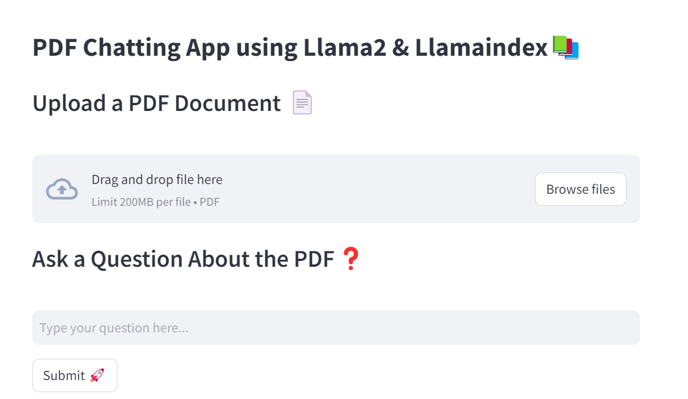

<div align="center">
  <h1>PDF Chat Application with GradientAI Integration 📚✨</h1>
  
</div>

[](https://github.com/asadnhasan/Pdf-Chat-App-Gradient/stargazers)
[](https://github.com/asadnhasan/Pdf-Chat-App-Gradient/network)
[](https://github.com/asadnhasan/Pdf-Chat-App-Gradient/issues)
[](https://discord.gg/EytJtd4dW4)
[](LICENSE)

Welcome to the PDF Chat Application, where PDFs meet interactivity! This Streamlit-powered app lets you upload any PDF and chat away, asking any questions you have about the document's content. Dive into the magic of LlamaIndex and GradientAI and experience a new era of document interaction.



## 🌟 Features

- **Interactive Chat**: Engage with your PDFs using natural language.
- **Smart Indexing**: Powered by LlamaIndex for lightning-fast responses.
- **Cutting-edge AI**: Utilizing GradientAI's NLP to understand and process your queries.
- **Sleek UI**: Built with Streamlit for an intuitive user experience.

🚀 Check out the demo of my PDF Chat application on Streamlit Cloud: https://gradient-pdf-chat.streamlit.app/

📊 Explore the code interactively on Google Colab: https://t.ly/SZfo3

[](https://hub.docker.com/repository/docker/asadnhasan/pdfchat-gradient/general)

### PDFChat Gradient

Welcome to PDFChat, a powerful tool for working with PDFs! 🚀 This Docker image is available on Docker Hub, making it easy to deploy and integrate with your projects. Check it out on [Docker Hub](https://hub.docker.com/repository/docker/asadnhasan/pdfchat-gradient/general) and get started with PDFChat Gradient!


[](https://hub.docker.com/repository/docker/asadnhasan/pdfchat-gradient/general)

## ⚙️ Installation

Want to get it running on your machine? It's as simple as:

```bash
git clone https://github.com/asadnhasan/Pdf-Chat-App-Gradient
cd asadnhasan/Pdf-Chat-App-Gradient
pip install -r requirements.txt
```

🚀 Usage
To launch the app, spin it up with:
```
streamlit run app.py
```
Visit http://localhost:8501 in your browser and start chatting with your PDF!

💡 How to Contribute
Got an idea to make this even better? Contributions are welcome!

Fork the Project
Create your Feature Branch (git checkout -b feature/AmazingFeature)
Commit your Changes (git commit -m 'Add some AmazingFeature')
Push to the Branch (git push origin feature/AmazingFeature)
Open a Pull Request
Don't forget to give this repo a ⭐ to help promote PDF Chat Application!

📝 License
Distributed under the MIT License. See LICENSE for more information.

## 🌐 Connect with Me

Hey there! I'm **Syed Asad**, the creator of this PDF Chat Application. If you're as excited about revolutionizing how we interact with PDFs as I am, let's connect! 

- 🌟 **LinkedIn**: [Syed Asad](https://www.linkedin.com/in/syed-asad-76815246/) - Let's connect professionally and expand our networks.
- 📧 **Email**: [asadnhasan@gmail.com](mailto:asadnhasan@gmail.com) - For inquiries, collaborations, or just a chat about technology and innovation.
- 🚀 **GitHub**: Follow my journey in open-source - [Syed's GitHub](https://github.com/asadnhasan)
- 💬 **Discord**: [Join our Discord Channel](https://discord.gg/EytJtd4dW4)

Feel free to reach out for discussions, collaborations, or just to say hi. I'm always open to new ideas and opportunities!


If you find the PDF Chat Application helpful or interesting, show some love with a ⭐ on GitHub. Happy chatting with your PDFs!
